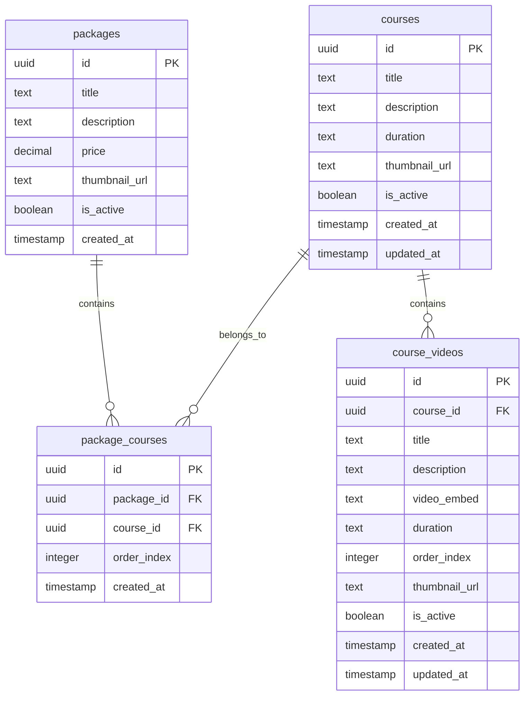
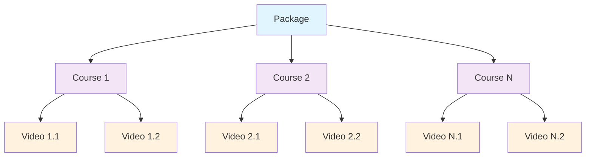
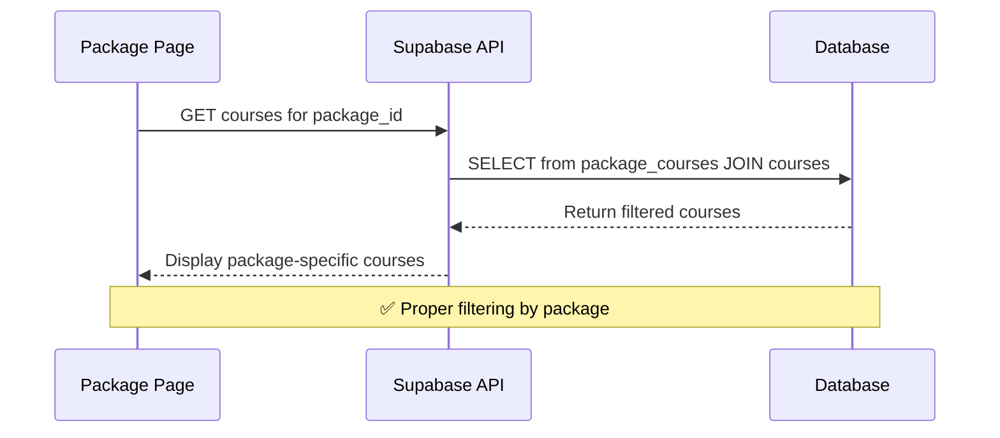
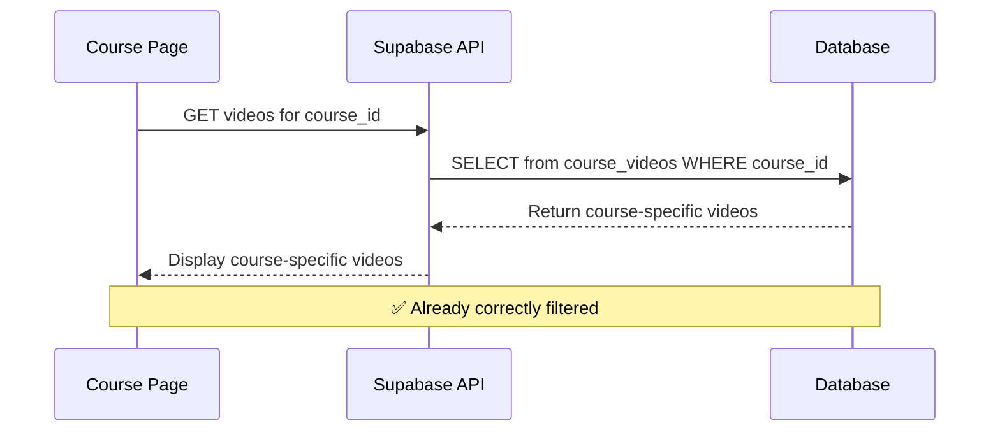
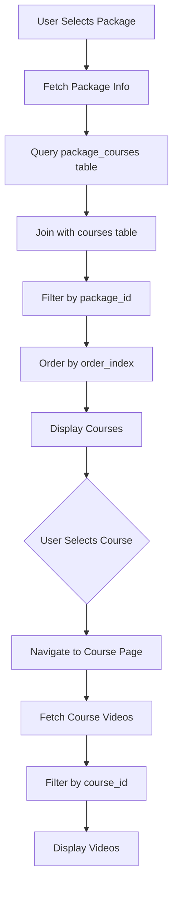
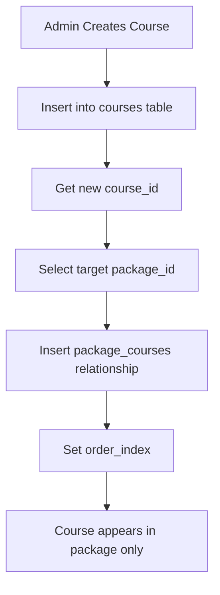
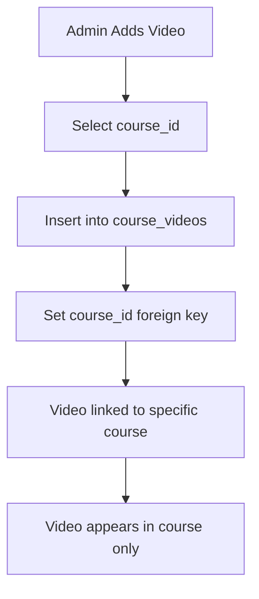
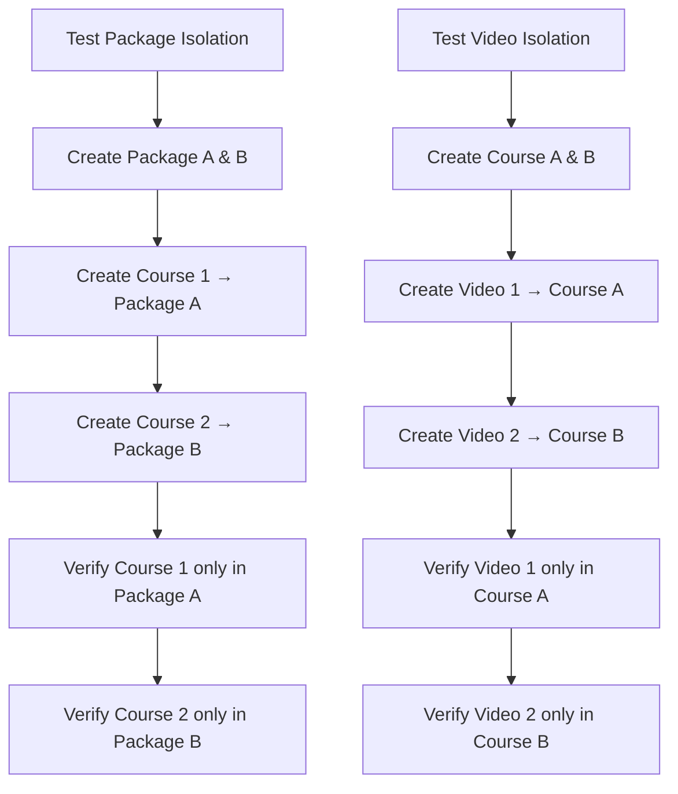
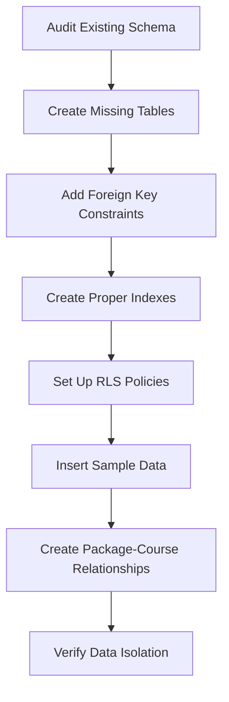
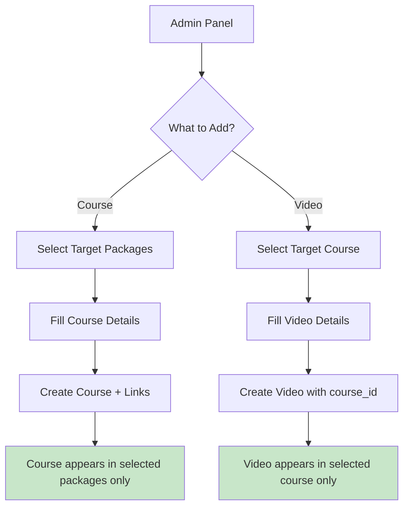

# Database Schema Audit & Relationship Fix

## Overview

The YouthPargati website has a critical database relationship issue where videos added to one course appear across all packages instead of being properly isolated. This document provides a comprehensive audit and fix for the database schema to enforce proper hierarchical relationships between packages, courses, and course videos.

## Architecture

### Current Database Structure



### Relationship Hierarchy



## Data Models & ORM Mapping

### Foreign Key Constraints

| Table | Column | References | Constraint |
|-------|--------|------------|------------|
| `package_courses` | `package_id` | `packages.id` | CASCADE DELETE |
| `package_courses` | `course_id` | `courses.id` | CASCADE DELETE |
| `course_videos` | `course_id` | `courses.id` | CASCADE DELETE |

### Data Isolation Rules

```sql
-- Rule 1: Course videos MUST be linked to specific course
ALTER TABLE course_videos 
ADD CONSTRAINT fk_course_videos_course_id 
FOREIGN KEY (course_id) REFERENCES courses(id) ON DELETE CASCADE;

-- Rule 2: Package-course relationships MUST be unique
ALTER TABLE package_courses 
ADD CONSTRAINT unique_package_course 
UNIQUE(package_id, course_id);

-- Rule 3: Course can belong to multiple packages (many-to-many)
-- Implemented via package_courses junction table
```

## API Endpoints Reference

### Package-Courses Query (Fixed Implementation)



### Course-Videos Query (Already Correct)



### Request/Response Schema

#### Package Courses Endpoint
```javascript
// Request
const { data, error } = await supabase
  .from('package_courses')
  .select(`
    order_index,
    courses (
      id, title, description, duration, thumbnail_url
    )
  `)
  .eq('package_id', packageId)
  .order('order_index', { ascending: true });

// Response Schema
[
  {
    order_index: 1,
    courses: {
      id: "uuid",
      title: "Course Title",
      description: "Course Description",
      duration: "2 hours",
      thumbnail_url: "https://..."
    }
  }
]
```

#### Course Videos Endpoint
```javascript
// Request
const { data, error } = await supabase
  .from('course_videos')
  .select('id, title, description, video_embed, duration, order_index')
  .eq('course_id', courseId)
  .order('order_index', { ascending: true });

// Response Schema
[
  {
    id: "uuid",
    title: "Video Title",
    description: "Video Description", 
    video_embed: "<iframe>...</iframe>",
    duration: "15:30",
    order_index: 1
  }
]
```

### Authentication Requirements

- **Read Access**: Public read access enabled via Row Level Security (RLS)
- **Admin Operations**: Require admin authentication for INSERT/UPDATE/DELETE operations
- **Student Access**: Students can only view active content (`is_active = true`)

## Business Logic Layer

### Package Display Logic



### Admin Panel Insert Logic

#### Adding a Course to Package



#### Adding Video to Course



### Data Validation Rules

| Operation | Validation Rule | Error Message |
|-----------|----------------|---------------|
| Insert Video | `course_id` must exist | "Course not found" |
| Insert Package-Course | `package_id` and `course_id` must exist | "Invalid package or course" |
| Insert Package-Course | Unique constraint | "Course already in package" |
| Delete Course | Cascade delete videos | "Videos will be removed" |
| Delete Package | Cascade delete relationships | "Course assignments removed" |

## Middleware & Interceptors

### Row Level Security Policies

```sql
-- Packages: Public read access for active packages
CREATE POLICY "Anyone can view active packages" ON packages
    FOR SELECT USING (is_active = true);

-- Courses: Public read access for active courses  
CREATE POLICY "Anyone can view active courses" ON courses
    FOR SELECT USING (is_active = true);

-- Package-Courses: Public read access for relationships
CREATE POLICY "Anyone can view package courses" ON package_courses
    FOR SELECT USING (true);

-- Course Videos: Public read access for active videos
CREATE POLICY "Anyone can view active course videos" ON course_videos
    FOR SELECT USING (is_active = true);
```

### Query Optimization Indexes

```sql
-- Performance indexes for relationship queries
CREATE INDEX idx_package_courses_package ON package_courses(package_id);
CREATE INDEX idx_package_courses_course ON package_courses(course_id);
CREATE INDEX idx_course_videos_course ON course_videos(course_id);
CREATE INDEX idx_course_videos_order ON course_videos(course_id, order_index);
```

## Testing Strategy

### Database Relationship Tests



### Frontend Query Tests

| Test Case | Expected Behavior | Validation |
|-----------|------------------|------------|
| Package A → Courses | Shows only courses assigned to Package A | `COUNT(courses) = assigned_count` |
| Package B → Courses | Shows only courses assigned to Package B | No overlap with Package A |
| Course X → Videos | Shows only videos assigned to Course X | `course_id` filter working |
| Empty Package | Shows "No courses available" | Graceful empty state |
| Empty Course | Shows "No videos available" | Graceful empty state |

### Test Data Setup

```sql
-- Test Package-Course Relationships
INSERT INTO packages (title, price) VALUES 
('Test Package A', 100.00),
('Test Package B', 200.00);

INSERT INTO courses (title, description) VALUES
('Course Alpha', 'Test course for Package A'),
('Course Beta', 'Test course for Package B'),
('Course Gamma', 'Test course for both packages');

-- Package A: Courses Alpha & Gamma
INSERT INTO package_courses (package_id, course_id, order_index)
SELECT p.id, c.id, 1
FROM packages p, courses c
WHERE p.title = 'Test Package A' AND c.title = 'Course Alpha';

-- Package B: Courses Beta & Gamma  
INSERT INTO package_courses (package_id, course_id, order_index)
SELECT p.id, c.id, 1
FROM packages p, courses c
WHERE p.title = 'Test Package B' AND c.title = 'Course Beta';
```

## Implementation Requirements

### Database Migration Script

The following SQL script must be executed in Supabase SQL Editor:

1. **Verify existing schema** and create missing tables
2. **Add proper foreign key constraints** if missing
3. **Create package-course relationships** for existing data
4. **Add sample test data** with proper relationships
5. **Verify data isolation** through test queries

### Frontend Code Updates

#### PackageCourses.jsx Fix

**Current Issue**: Queries all courses instead of package-specific courses

**Required Change**:
```javascript
// Replace direct courses query
const { data, error } = await supabase
  .from('courses')
  .select('id, title, description')
  .limit(6);

// With relationship-based query
const { data, error } = await supabase
  .from('package_courses')
  .select(`
    order_index,
    courses (
      id, title, description, duration, thumbnail_url
    )
  `)
  .eq('package_id', packageId)
  .order('order_index', { ascending: true });
```

#### Admin Panel Requirements

**Course Creation**:
1. Insert course into `courses` table
2. Link to package via `package_courses` table
3. Set appropriate `order_index`

**Video Creation**:
1. Select target course from package-specific courses
2. Insert video with proper `course_id` foreign key
3. Set appropriate `order_index` within course

### Expected Behavior After Fix

| User Action | Current (Broken) | After Fix (Correct) |
|-------------|------------------|-------------------|
| View Package A | Shows all courses | Shows only Package A courses |
| View Package B | Shows all courses | Shows only Package B courses |
| Add video to Course 1 | Appears in all courses | Appears only in Course 1 |
| Add course to Package A | No relationship tracking | Linked only to Package A |

## Database Schema Fix Implementation

### Step 1: Execute Database Migration

Run the existing `database-relations-audit-fix.sql` file in Supabase SQL Editor. This script will:



### Step 2: Frontend Query Updates

#### PackageCourses.jsx Implementation

```javascript
// Current broken implementation
const fetchPackageAndCourses = async () => {
  // ❌ This shows ALL courses for every package
  const { data, error } = await supabase
    .from('courses')
    .select('id, title, description')
    .limit(6);
};

// ✅ Correct implementation with relationships
const fetchPackageAndCourses = async () => {
  try {
    // Fetch package information
    const { data: packageData, error: packageError } = await supabase
      .from('packages')
      .select('id, title, description, price, thumbnail_url')
      .eq('id', packageId)
      .single();

    if (packageError) throw packageError;
    setPackageInfo(packageData);

    // Fetch courses using proper relationship
    const { data: coursesData, error: coursesError } = await supabase
      .from('package_courses')
      .select(`
        order_index,
        courses (
          id, title, description, duration, thumbnail_url
        )
      `)
      .eq('package_id', packageId)
      .order('order_index', { ascending: true });

    if (coursesError) throw coursesError;

    // Transform data for UI
    const transformedCourses = coursesData?.map(item => ({
      id: item.courses.id,
      title: item.courses.title,
      description: item.courses.description,
      duration: item.courses.duration,
      thumbnail_url: item.courses.thumbnail_url,
      order_index: item.order_index
    })) || [];

    setCourses(transformedCourses);
  } catch (error) {
    setError(`Failed to load package courses: ${error.message}`);
  }
};
```

#### CourseVideos.jsx (Already Correct)

The CourseVideos component already implements proper filtering:

```javascript
// ✅ This is already correct - shows only videos for specific course
const { data, error } = await supabase
  .from('course_videos')
  .select('id, title, description, video_embed')
  .eq('course_id', courseId) // Proper filtering by course
  .order('order_index', { ascending: true });
```

### Step 3: Admin Panel Implementation

#### Creating a Course

```javascript
const createCourse = async (courseData, selectedPackageIds) => {
  try {
    // Step 1: Create the course
    const { data: newCourse, error: courseError } = await supabase
      .from('courses')
      .insert({
        title: courseData.title,
        description: courseData.description,
        duration: courseData.duration,
        thumbnail_url: courseData.thumbnail_url,
        is_active: true
      })
      .select()
      .single();

    if (courseError) throw courseError;

    // Step 2: Link course to selected packages
    const packageCourseLinks = selectedPackageIds.map((packageId, index) => ({
      package_id: packageId,
      course_id: newCourse.id,
      order_index: index + 1
    }));

    const { error: linkError } = await supabase
      .from('package_courses')
      .insert(packageCourseLinks);

    if (linkError) throw linkError;

    return { success: true, course: newCourse };
  } catch (error) {
    return { success: false, error: error.message };
  }
};
```

#### Adding a Video to Course

```javascript
const addVideoToCourse = async (videoData, courseId) => {
  try {
    // Ensure course_id is always set
    const { data: newVideo, error } = await supabase
      .from('course_videos')
      .insert({
        course_id: courseId, // ✅ Critical: Always link to specific course
        title: videoData.title,
        description: videoData.description,
        video_embed: videoData.embedCode,
        duration: videoData.duration,
        order_index: videoData.order || 1,
        thumbnail_url: videoData.thumbnail_url,
        is_active: true
      })
      .select()
      .single();

    if (error) throw error;

    return { success: true, video: newVideo };
  } catch (error) {
    return { success: false, error: error.message };
  }
};
```

#### Admin Panel UI Flow



### Step 4: Data Validation & Testing

#### Validation Queries

```sql
-- Test 1: Verify package isolation
SELECT 
    p.title as package_name,
    COUNT(pc.course_id) as course_count,
    STRING_AGG(c.title, ', ') as courses
FROM packages p
LEFT JOIN package_courses pc ON p.id = pc.package_id
LEFT JOIN courses c ON pc.course_id = c.id
GROUP BY p.id, p.title
ORDER BY p.title;

-- Test 2: Verify video isolation
SELECT 
    c.title as course_name,
    COUNT(cv.id) as video_count,
    STRING_AGG(cv.title, ', ') as videos
FROM courses c
LEFT JOIN course_videos cv ON c.id = cv.course_id
GROUP BY c.id, c.title
ORDER BY c.title;

-- Test 3: Check for orphaned records
SELECT 'Orphaned Videos' as issue, COUNT(*) as count
FROM course_videos cv
LEFT JOIN courses c ON cv.course_id = c.id
WHERE c.id IS NULL;
```

### Step 5: Error Handling & Fallbacks

#### Graceful Degradation

```javascript
const fetchCoursesWithFallback = async (packageId) => {
  try {
    // Try relationship-based query first
    const { data, error } = await supabase
      .from('package_courses')
      .select('courses(*)')
      .eq('package_id', packageId);
    
    if (error) throw error;
    return data?.map(item => item.courses) || [];
    
  } catch (error) {
    console.warn('Relationship query failed, using fallback:', error);
    
    // Fallback: Show sample courses with warning
    return [
      {
        id: 'fallback-1',
        title: 'Sample Course (Fix Database)',
        description: 'Database relationships need to be configured'
      }
    ];
  }
};
```